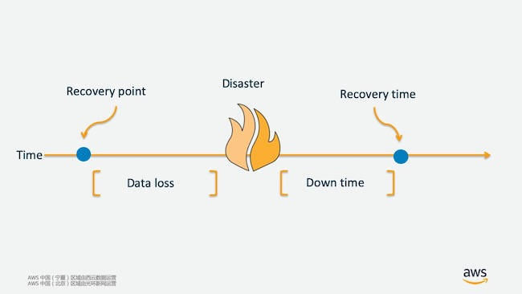
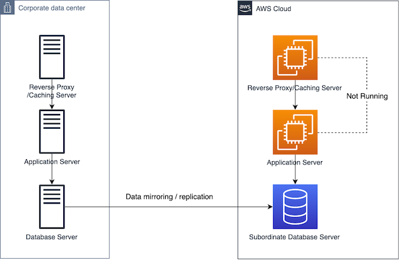

# 业务持续性 & AWS 备份与灾备解决方案

本文针对web hosting经典架构的场景，根据生产环境来源的不同，介绍了在AWS上搭建容灾备份系统的四大方案。每一种方案都给出了具体的**解决方案**、**架构图**、**成本估算**、**具体执行步骤** 和 **自动化脚本**。
企业可结合自己对应用系统PTO和PRO的要求以及成本预算，选择适合自己的灾备方案。

## 场景综述
维持业务持续性对于企业至关重要, 关键业务系统宕机可能会对企业带来重大影响，企业声誉、客户满意度或公司的财务的状况都可能受到难于挽回的重大损失。
因此，构建高可用高容灾的IT系统和建设IT灾备系统，具有显而易见的价值。

在灾备解决方案的选定上，企业需要先制定好两个重要指标：恢复时间RTO（故障恢复时间），和恢复点RPO（可忍受数据损失的时间点）。基于这两个关键业务指标，企业
IT部门可以设计相应的应用架构、备份架构和灾备体系，通过使用一系列镜像/快照等技术手段，来实现相应系统的连续性服务水平。

在传统做法中，实施较高要求的容灾和灾备系统，往往不光要求企业花费大量时间和精力，而且部署复杂且价格昂贵。这对于多数企业，特别是中小型企业，都是一个巨大的负担。使用公有云的
基础设施来实现数据保护、备份归档和灾难备份，拥有传统IT无法比拟的巨大优势。

本文首先对灾备的基本概念做概况介绍，之后将利用wordpress模板模拟经典web hosting架构的应用场景，给出基于AWS的不同指标的4种备份/灾备方案，并做关键指标的对比。

## 本文目录
1. [关键指标 RPO & RTO](#关键指标-RPO-&-RTO)
1. [灾备类型](#灾备类型)
1. [模拟内容](#模拟内容)
1. [AWS 组件的计费模型](#AWS-组件的计费模型)
1. [不同场景下的解决方案](#不同场景下的解决方案)
1. [脚本下载](#脚本下载)
1. [总结](#总结)

## 关键指标 RPO & RTO

1. RTO (Recovery Time Objective，复原时间目标)是指灾难发生后，从IT系统当机导致业务停顿之时开始，到IT系统恢复至可以支持
各部门运作、恢复运营之时，此两点之间的时间段称为RTO。比如说灾难发生后半天内便需要恢复，RTO值就是十二小时。

1. RPO (Recovery Point Objective，复原点目标)是指从系统和应用数据而言，要实现能够恢复至可以支持各部门业务运作，恢复得来
的数据所对应时的间点。如果现时企业每天凌晨零时进行备份一次，当服务恢复后，系统内储存的只会是最近灾难发生前那个凌晨零时的资料。

1. 该图解释了 RTO 和 RPO 与时间轴的关系。
    

## 灾备类型

不同的业务对于 RPO 和 RTO 的要求也不同。根据不同的要求，我们大概可以将灾备归类 **Cold Backup** , **Pilot Light** ,
**Warm Standby** 和 **Hot Site**. 以下将介绍四种灾备类型的架构设计和灾中切换过程。

1. **Cold Backup(冷备)** 
是指定期导出并上传业务数据；当灾难发生时，启动数据层和应用层资源，并导入数据。
例如 MySQL 利用 mysqldump 工具进行定期的全量备份或增量备份。

1. **Pilot Light(小火苗)** 
是指实时异步复制业务数据；当灾难发生时，启动应用层资源。
    

1. **Warm Standby(温备)** 是指实时复制业务数据，应用层保持小规模资源配置；当灾难发生时，迅速扩大应用层资源。
    
    
1. **Hot Site(热备)** 是指实时同步/异步双向复制业务数据，应用层资源保持一定规模的配置，DNS 按权重
解析到两个站点；当灾难发生时，DNS解析到单个站点, 并迅速扩大应用层资源。
    

不同的备份方式所产生的成本也不同，以下是4种类型适合业务类型和成本对比:

|      |Cold	| Pilot  Light |	Warm |	Hot Standby |
| ---- | ------ | ------------ | --------| ------------ |
| 用户场景 | 非核心业务 |	关键业务 | 	核心业务 | 核心业务不受影响, 自动恢复 |
| RTO & RPO 要求 |	天 | 小时级 | 分钟级 |	秒级 |
| 成本 |	$ | $$ | $$$ | $$$$ |

## 模拟内容

本专题是模拟一个典型的Web Hosting 场景，即 WordPress Cluster 在不同场景下进行不同类型的备份。通过此模拟场景，提供
不同场景下，不同类型的灾备 **解决方案**、**架构图**、**成本估算**、 **执行步骤** 和 **自动化脚本** 。

我们假设 WordPress Cluster 组件如下：

* MySQL: WordPress 数据库 
* Redis: 使用 Redis Object Cache 插件，使得 WordPress 支持Redis 作为缓存，提高用户访问体验
* 共享存储: WordPress 的文件存储在共享存储上，每一台 WordPress 实例都可以访问相同的共享存储
* 应用服务器: 安装 WordPress 应用
* 负载均衡:  将接收到的流量转发给后端的 WordPress 集群

不同类型的备份所需策略也不同。上述 WordPress Cluster 场景，只有 MySQL 和 WordPress 文件存储内有持久化数据，将迁移的大致策略归纳总结如下：

|      | 备份策略 | 灾前准备工作 | 灾中切换 |
| ---- | ---- | ---- | ---- |
| Cold | 1. 定期备份MySQL 2. 定期备份Wordpress文件 |	1. 在灾备环境准备好网络等基础服务  2. 自动化启动数据层，应用层脚本 |	1. 启动数据库，文件存储  2. 导入数据  3. 启动应用层  4. DNS 解析到灾备区域 |
| Pilot Light |	1. 开启MySQL 只读副本  2. 异步持续备份WordPress 存储文件 | 1. 在灾备环境准备好网络等基础服务  2. MySQL 只读部分，存储文件备份 3. 自动化启动应用层脚本 | 1. 提升MySQL 只读副本为主库  2. 启动应用层  3. DNS 解析到灾备区域 |
| Warm Standby | 1. 开启MySQL 只读副本  2. 异步持续备份WordPress 存储文件 | 1. 在灾备环境准备好网络等基础服务  2. MySQL 只读部分，存储文件备份   3. 自动化启动应用层脚本 4. 启动小规模应用层	| 1. 提升MySQL 只读副本为主库   2. 提升应用层规模  3. DNS 解析到灾备区域 |
| Hot Standby | 1. MySQL 设置成互为主备  2. WordPress 存储文件双向拷贝 | 1. 在灾备环境准备好网络等基础服务  2. MySQL 设置成互为主备模式   3. WordPress 文件双向拷贝 4. 启动应用层 5. DNS 根据预先设置的策略解析到两个站点 |	1. 故障发生时，DNS 解析到单个站点 |

## AWS 组件的计费模型

在模拟场景中将使用到一些 AWS 的常见服务，其计费模型如下:
<table>
   <tr>
      <th>功能</th>
      <th>资源 </th>
      <th>费用说明</th>
   </tr>
   <tr>
      <td rowspan=5>Web层</td>
      <td>ELB</td>
      <td>在灾备区按用量收费</td>
   </tr>
   <tr>
      <td>EC2</td>
      <td>根据实际使用的类型按灾备区定价收费</td>
   </tr>
   <tr>
      <td>EC2 AMI</td>
      <td>如果您使用由实例存储提供支持的 AMI，您需要为实例使用和在 Amazon S3 中存储 AMI 付费。使用由 Amazon EBS 支持的 AMI，您需要为实例使用、Amazon EBS 卷的存储和使用、以 Amazon EBS 快照形式存储 AMI 付费。</td>

   </tr>
   <tr>
      <td>EBS快照</td>
      <td>按EBS的快照存储大小收费</td>    
   </tr>
   <tr>
      <td>EBS 卷</td>
      <td>单独使用的EBS卷的容量费用</td>
   </tr>
   <tr>
      <td rowspan="5">应用层</td>
      <td>ELB</td>
      <td>在灾备区按用量收费</td>
   </tr>
   <tr>
      <td>EC2</td>
      <td>根据实际使用的类型按灾备区定价收费</td>
   </tr>
   <tr>
      <td>EC2 AMI</td>
      <td>如果您使用由实例存储提供支持的 AMI，您需要为实例使用和在 Amazon S3 中存储 AMI 付费。使用由 Amazon EBS 支持的 AMI，您需要为实例使用、Amazon EBS 卷的存储和使用、以 Amazon EBS 快照形式存储 AMI 付费。</td>
   </tr>
   <tr> 
      <td>EBS快照</td>
      <td>按EBS的快照存储大小收费</td>
   </tr>
   <tr>
      <td>EBS 卷</td>
      <td>单独使用的EBS卷的容量费用</td>
   </tr>
   <tr>
      <td>缓存层</td>
      <td>Redis 备份文件</td>
      <td>ElastiCache 允许您免费为每个活动 Redis 集群存储一个备份。对于所有区域，其他备份的存储空间按每月 0.085 美元/GB 的费率收费。对于创建备份或者将备份中的数据还原到 Redis 集群，没有数据传输费。拷贝到灾备区会产生备份文件存储费用<</td>
   </tr>
   <tr>
      <td rowspan="3">数据库层</td>
      <td>数据库实例</td>
      <td>实例费用按使用的EC2类型收费</td>
   </tr>
   <tr>
      <td>数据库存储</td>
      <td>按实际的数据量占用的空间收费</td>
   </tr>
   <tr>
      <td>数据库快照</td>
      <td>当灾备的数据库进行备份或快照时会产生存储费用</td>
   </tr>
   <tr>
      <td>S3对象存储</td>
      <td>文件存储服务</td>
      <td>根据存储量收取S3的存储费用</td>
   </tr>
   <tr>
      <td>Internet流量</td>
      <td>数据流出到Internet费用</td>
      <td>按照云数据中心向Internet传输的流量计费，不限带宽</td>
   </tr>
</table>

## 不同场景下的解决方案

根据原生产环境部署位置的不同，本文介绍相应的不同方案，比如AWS的多区域容灾，IDC到AWS的容灾，友商到AWS的容灾等。详细步骤请分别点击以下链接：

* [AWS 多区域灾备 Pilot Light Backup](aws-multi-region-pilot-light/README.md)
* [AWS 多区域 Cold Backup](aws-multi-region-cold-backup/README.md)
* [On-premise 到 AWS Cold Backup & Pilot Light](aws-on-premise-to-aws-backup/README.md)
* [其他云服务商到 AWS Cold Backup](ali-to-aws-cold-backup/README.md)

## 脚本下载
基于 WordPress Cluster 的设定场景，上述详细方案的执行脚本发布在 [此GitHub Repo](https://github.com/lab798/aws-dr-samples)下。项目内有三个文件夹，`basic`, `database`, `app`
您可以根据需求修改具体参数，来满足对于业务持续性的需求。当做环境切换时，只需要一键启动此模板，即可轻松恢复生产环境。具体使用方法，**请分别点击每篇文章查看**。

## 总结
本文简述了常见的标准灾备方案，并在关键指标以及成本角度做了简单的对比。我们可以根据业务实际部署的情况，在AWS上选择适合自己的灾备方案。