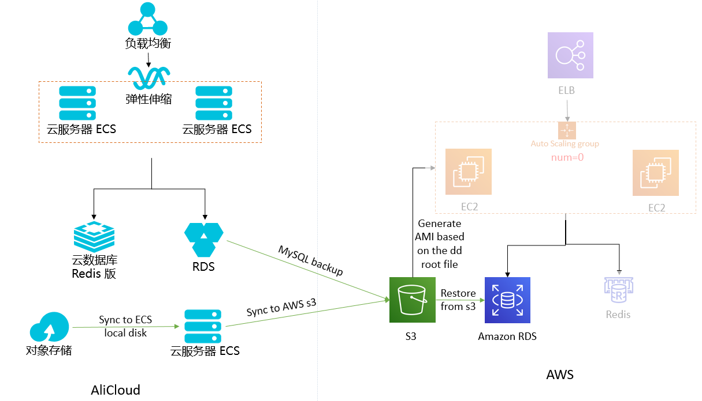

# 阿里云 到 AWS Cold Backup 容灾解决方案

该方案模拟在阿里云上的WordPress cluster应用通过 **Cold Backup** 的方式备份到 AWS 宁夏区域。**RTO 和 RPO 目标均为 24 小时** 。   

阿里云上的部署如下：

* RDS MySQL: WordPress 数据库
* 云数据库版Redis: 使用 Redis Object Cache 插件，使得 WordPress 支持Redis 作为缓存
* 对象存储OSS: WordPress 的文件存储在 OSS 上，通过 [OSSFS](https://help.aliyun.com/document_detail/32196.html) 软件挂载到 ECS
* 云服务器ECS: 安装 WordPress 应用，ECS 通过弹性伸缩服务实现自动伸缩
* 负载均衡SLB: 作为负载均衡，将接收到的流量转发给后端的 WordPress 集群   


## 架构



## 解决方案

### 备份方案

1. 把阿里云数据库和OSS中的数据每天备份并传输到AWS平台上，一旦阿里云环境出现故障，可以在AWS平台上快速启动应用系统。
1. 本方案中暂时不考虑直接迁移阿里云的ECS服务器到AWS平台，因为如果直接迁移阿里云的ECS镜像到AWS的话，该镜像里会有很多阿里云平台的一些进程，可能会带来很多复杂的情况。因此假定应用系统预先在AWS上做好了AMI。
1. 每天对阿里云的RDS进行备份，并把备份文件传输到AWS S3。
1. 启动一台阿里云ECS服务器，并挂载普通云盘，其大小与OSS上要同步的文件大小相同。并通过脚本每天进行增量同步到本地磁盘，然后通过awscli的s3命令sync到AWS S3。
1. ELB,NAT, Redis, App, Database 这些都不启动，等到受灾之后通过脚本启动。

### 恢复方案

1. 通过阿里云MySQL RDS在S3中的备份，恢复一个新的Amazon RDS实例。
1. Redis不含持久化数据，无需实现复制，只需script启动即可。
1. 提前在宁夏区配置好网络环境，当灾难发生时，通过脚本启动资源；手动或者通过脚本自动导入 MySQL 数据

> 恢复脚本及使用方法已上传到[lab798/aws-dr-samples](https://github.com/lab798/aws-dr-samples)。


## 备份步骤

### RDS 数据库备份

* 按照类似如下方式编辑backup.sh，从而备份数据库以及上传备份文件到 Amazon S3
   ```
   mysqldump -h <alicloud rds endpoint> -u root -p<password> wordpress > wordpress.sql
   ```

* 将备份文件上传到 Amazon S3
   ```
   aws s3 cp wordpress.sql s3://<your bucket>/<your prefix>/
   ```
### 备份OSS的数据到AWS S3

* 把OSS bucket 挂载到本地目录，参考 OSSFS 快速安装 (https://help.aliyun.com/document_detail/32196.html)。
* 增量同步到AWS S3  
   ```
   aws s3 sync <ossfs local folder> s3://<your bucket>/<your prefix>/
   ```

* 可以把该命令放入上一步备份数据库的脚本中，完整的 backup.sh 脚本内容如下:
   ```
   currentdate=` date +%Y%m%d `
   mysqldump -h <alicloud rds endpoint> -u root -p<password> wordpress > wordpress.sql
   aws s3 cp wordpress.sql s3://<your bucket>/<your prefix>/$currentdate/
   aws s3 sync <ossfs local folder> s3://<your bucket>/<your prefix>/$currentdate/
   ```

### 自动化备份

* 编写 cronjob，每天晚上定期执行 backup.sh，比如下面的例子表示每天晚上10:30进行备份：
    ```shell script
    30 22 * * * /root/backup.sh
    ```

## 成本分析

冷备成本是指容灾region在灾备过程中所产生的成本，此成本具有时效性，同时和购买类型也有关系。

以 **宁夏区(ZHY)** 为例，按照上述灾备方案，假定需要的灾备资源及产生的费用为：

* **AMI 20G**: 镜像文件在宁夏区存储的费用   
* **S3 1T 不频繁访问**：由于是灾备访问，平时不会被使用，推荐不频繁访问

   | 项目               | 类型	       | 单价             | 1 年费用           |
   | :-----              | :-----      | :-----          | :-----             |
   | AMI 20GB            |   EBS 	   | 0.277/GB/月     |	66.48 RMB            |
   | S3 不频繁访问 1 TB   |	  S3-IA    | 0.1030029/GB/月 |	1265.7 RMB           |
   | 总价                |             |                 | 	1332.18 RMB      |
   | 含税总价             |             |                 | 	1412.1108  RMB      |

## 注意事项

1. 容灾方案中的Redis节点是冷启动，启动后内存中没有恢复已有缓存的数据。因此您需要关注灾难恢复后数据库可能会遭受来自客户端重试导致瞬间的读写冲击。您应该在应用代码中实施类如熔断等机制以减少冲击。
1. 在本次方案中，您需要在灾难恢复时填写保存在宁夏区域的AMI ID，以作为 AutoScaling Launch Template中EC2启动的镜像。
1. 本安装需要您在宁夏区重新搭建一份 WordPress 应用。如果您在阿里云平台上对ECS进行了变更，请及时把该变更在宁夏区也同步完成，并生成对应的AMI，以保证宁夏区域的AMI保持最新状态。

