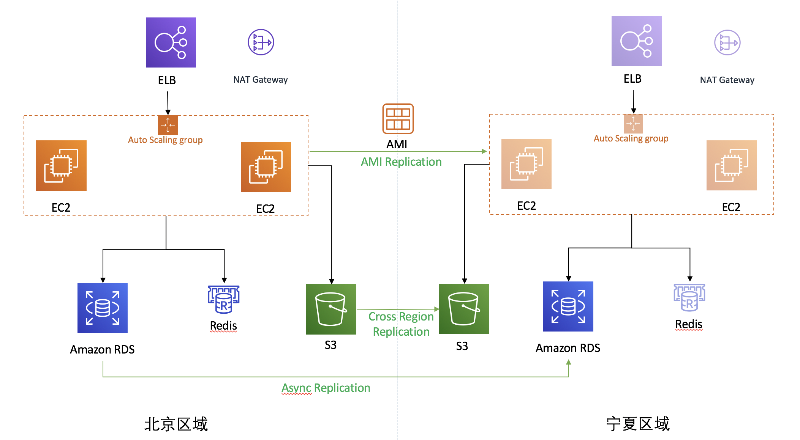
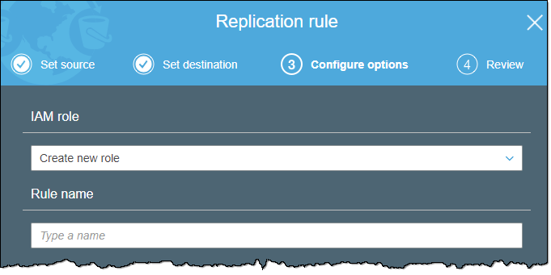
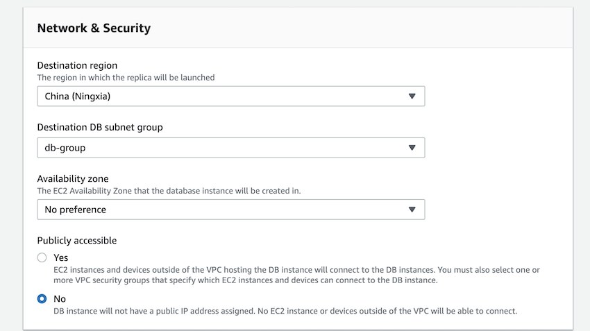
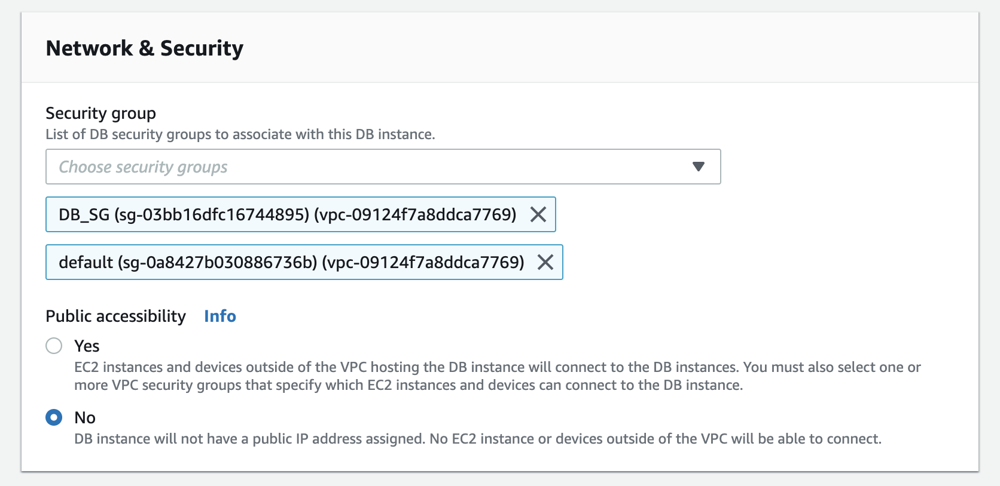
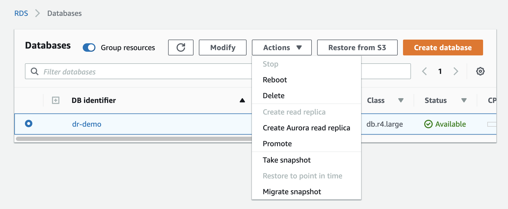

# AWS Multi-Region Pilot Light 灾备解决方案

该方案是模拟一个 WordPress cluster 部署在 AWS 上进行 multi-region pilot light 灾备的方案。生产区域组件选择如下：

* RDS MySQL: WordPress 数据库
* ElastiCache: 使用 Redis Object Cache 插件，使得 WordPress 支持Redis 作为缓存，提高用户访问体验
* S3: WordPress 的文件存储在 S3 上，通过 S3FS 软件挂载到EC2
* EC2: 安装 WordPress 应用，通过Auto Scaling Group 实现弹性伸缩
* ELB:  作为负载均衡，将接收到的流量转发给后端的 WordPress 集群
* NAT Gateway: WordPress 经由 NAT 网关主动访问外网

## 架构
根据 Pilot Light 的需求，我们需要将 WordPress 的文件存储，和数据库异步同步到其他其他区域。架构图如下：



部分闲置的AWS组件会给客户增加额外的成本，因此在整个方案中，除了VPC预配置和RDS热备外，其余所有的组件
都是灾难发生后通过脚本动态创建，达到最小的Infra cost。当发生时，用户通过预先定义好的灾备脚本，在灾备
区域快速构建 AWS 资源。

**RDS MySQL 数据备份**
RDS Mysql配置Cross Region Replica，实现数据库的异步复制。如何配置跨Region只读副本，请参考[文档](https://docs.aws.amazon.com/zh_cn/AmazonRDS/latest/UserGuide/USER_ReadRepl.html#USER_ReadRepl.XRgn)。
当灾难发生后，通过提升只读副本为独立的数据库实例，使其能够执行正常的写入操作。在本方案中，会使用脚本实现
提升只读副本的操作。

**S3 Bucket 数据备份(WordPress Media File)**
开启S3 Cross Region Replication，实现S3文件的跨Region自动复制。关于如何开启S3跨区域复制，
请参考[文档](https://docs.aws.amazon.com/zh_cn/AmazonS3/latest/dev/crr.html)。

**应用镜像**
当北京区域新建AMI后，需要把新建的AMI复制到宁夏区域。您可以手动触发[复制过程](https://docs.aws.amazon.com/zh_cn/AWSEC2/latest/UserGuide/CopyingAMIs.html)
也可以通过脚本自动化整个过程，例如在CloudWatch Event中设定时任务，触发lambda捕捉某段时间内
新建的AMI，通过简单的AWS api调用把新建的AMI复制到到宁夏区域。请根据项目实时性的需求为定时任务
设定合适的执行频率。

**应用配置**
在EC2的启动配置中设置user-data，使EC2内应用程序在启动后能够获取所需的配置，例如RDS Mysql和
Redis的endpoint等等。启动配置已经包含在灾难恢复的脚本中。

**灾备脚本**
按照上述方案，在[GitHub aws-dr-samples](https://github.com/lab798/aws-dr-samples)上提供了基于 
[Terraform](https://terraform.io/) 的可执行脚本，该套脚本可以帮助用户快速构建模拟生产环境和灾备环境。
用户根据所需创建的资源写成脚本文件。执行脚本时，Terraform 通过调用 AWS API 来快速构建 AWS 资源。下文有如何使用的详细步骤描述。

在本方案中，设定Redis不包含持久化数据。因此无需实现复制，只需在灾难恢复时通过脚本创建新实例即可。

当灾难发生后，按照以下顺序进行灾难恢复：

1. 手动提升RDS只读副本为独立的数据库实例.
1. 执行脚本创建容灾集群。
1. 进行健康检查，确定容灾集群能够正常运行。
1. 执行DNS切换，把用户访问切换到容灾集群。

接下来，我们会详细描述该方案的实施步骤和脚本运行执行过程。

## 价格

以宁夏区为例，按照上述灾备方案，假定需要的灾备资源及产生的费用为：

* AMI 20G: 镜像文件在宁夏区存储的费用
* S3 1T 不频繁访问：由于是灾备访问，平时不会被使用，推荐不频繁访问
* RDS Read Replica: 跨区域可读实例
* 跨区域网络传输 2T: 包括S3 跨区域拷贝，Read Replica 跨区域复制等等

| 服务                    | 类型             | 单价            | 1 年价格 |
| ----------------------- | ---------------- | --------------- | -------- |
| AMI 20G                 |                  | 0.277/GB/月     | 66.48    |
| S3 不频繁访问 1T        |                  | 0.1030029/GB/月 | 1265.7   |
| RDS Read Replica        | db.m4.large 单AZ | 1.1733/小时     | 5540     |
| Cross Region traffic 2T |                  | 0.6003/GB       | 1229.414 |
|                         |                  | Total           | 8101.594 |
|                         |                  | Total with tax  | 8587.69  |

*以上仅做参考，实际配置情况，应该根据工作负载合理配置。*

## 详细步骤
### terraform目录结构
terraform脚本请点击[此处](https://github.com/lab798/aws-dr-samples)获取。
项目内有三个文件夹，`basic`, `database`, `app`。 
- basic: 基础结构。可用于构建基础网络架构, 基础安全配置等等。 包含如下资源：
  * VPC
  * Subnet (包含 public subnet, private subnet)
  * Security Group 
  * DB Subnet Group
  * Cache Subnet Group
  * Route Table

- database: 数据库架构。用于自动创建 RDS 实例。包含如下资源：
  * Database Parameter Group
  * Database 实例
  
- app：应用相关资源。可用于自动构建缓存，应用及更新配置文件。包含如下资源:
  * Redis
  * Application Load Balancer
  * NAT
  * Route Table (给私有子网增加 NAT 路由)
  * Launch Template
  * Auto Scaling Group
  * Application Load Balancer
  * Listener, Target Group
  * 自动生成配置文件
  * S3FS 自动挂载到 EC2 作为 WordPress 的 Media Library


### 准备工作
1. 本文使用 AWS China Region, 如使用 AWS Global Region，需要修改镜像地址和 region 信息。
1. 提前提升好 limits. 每一项 AWS 服务都有 limits，确保灾备切换时，能否启动足够的资源来支撑应用。
1. 本文架构部署使用 [**Terraform**](https://www.terraform.io/) 一键部署AWS 资源，
请在本机安装 **Terraform**, 并配置好[AWS Credentials](https://docs.aws.amazon.com/cli/latest/userguide/cli-configure-files.html) 
1. Terraform 可以将信息存储在 S3 和 DynamoDB 中，创建用于存储 Terraform 状态的 S3 Bucket和 DynamoDB Table（由于使用的很少，DynamoDB 建议使用 On-Demand 
收费方式）, 该 DynamoDB 的 primary key 必须为 `LockID`，类型为 string。在本环境中，该 DynamoDB Table名称
为`tf-state`。
   >Note: **请勿在生产区域部署 S3, DynamoDB**，防止 Region Down 之后，无法使用 Terraform。
1. 在生产区域制作 AMI, 并拷贝到灾备区域。
出于演示的目的，已经提前在 AWS 中国区域部署了 WordPress 5.2.2 版本的AMI. WordPress 应用程序位 于 /var/www/html 目录下，可直接使用。
   - 北京区域 AMI: ami-0eebef1aaa174c852
   - 宁夏区域 AMI: ami-0cbbf10eaeaf0f9c3
>Note: 由于 WordPress 会记录域名，请勿使用ELB的域名直接访问, 为 WordPress 配置自定义域名。
1. 将使用到的 SSL 证书提前导入 IAM。
1. 修改 `<project>/index.tf` 和 `<project>/variables.tf`.  `<project>`代表`basic`, `database`, `app`三个相应folder的泛指，请分别进行修改。
  - **index.tf** 是状态信息保存的地方, 需要使用到之前提到的 DynamoDB 和 S3。
  - **variables.tf** 是模板的变量, 根据实际情况修改。
1. 配置好 AWS Credentials. 该 credentials 需要具备访问 S3, DynamoDB 及自动创建相关资源的权限。
1. 中国大陆地区执行 terraform init 下载 `aws provider` 会比较慢，可提前手动下载, 
并解压到`<project>/.terraform/plugins/<arch>/` 目录下。`<arch>` 为本机的系统和CPU架构, 
如 `darwin_amd64`, `linux_amd64`。
**[>>>点击此处手动下载 Terraform AWS Provider<<<](https://releases.hashicorp.com/terraform-provider-aws/)**

### (可选)创建模拟生产环境
> 如果对现有生产环境进行操作，直接跳过此步骤。

该步骤创建模拟的生产环境，用于演示。可以选择手动创建，或者利用脚本快速创建。使用脚本的好处是，
在演示结束后，我们可以快速销毁演示环境。

**创建基础环境**
1. 修改 `basic/variables.tf` 和 `basic/index.tf`
1. 在 basic 目录下执行 `terraform init`
1. 执行 `terraform workspace new prod` 创建 模拟生产环境的 workspace. 
我们使用 workspace 来区分是模拟生产环境或者灾备环境
1. 执行 `terraform apply` 创建基础网络环境

**创建数据库**
1. 修改 `database/variables.tf` 和 `database/index.tf`
1. 在 database 目录下执行 `terraform init`
1. 执行 `terraform workspace new prod` 创建 模拟生产环境的 workspace. 
1. 执行 `terraform apply` 创建数据库相关资源

**创建应用层**
1. 在模拟生产区域创建 S3 Bucket, 并启用 **versioning** 功能，用于存储 WordPress media 文件
1. 修改 `app/variables.tf` 和 `app/index.tf`
1. 在 app 目录下执行 `terraform init`
1. 执行 `terraform workspace new prod` 创建模拟生产环境的 workspace
1. 执行 `terraform apply` 创建APP相关资源


### 灾备环境准备工作
我们需要提前在灾备环境创建基础网络架构，来使得灾难发生时可以快速切换。在使用以下脚本的时候
注意参数的配置。推荐使用脚本创建，这样可以提高自动化的水平。

如果已经在**创建模拟生产环境**中修改了 `index.tf` 文件，无需修改该文件。

**拷贝镜像**
1. 在生产区域中选择 EC2, 创建镜像文件 
1. 需要拷贝的镜像文件, 拷贝到灾备区域

**创建基础环境**
1. 修改 `basic/dr.tfvars` 和 `basic/index.tf`
1. 在 basic 目录下执行 `terraform init`
1. 执行 `terraform workspace new dr` 创建灾备环境的 workspace. 
我们使用 workspace 来区分是模拟生产环境或者灾备环境
1. 执行 `terraform apply --var-file=dr.tfvars` 创建基础网络环境

**S3 数据同步**
1. 在灾备区域中创建 S3 Bucket, 并启用 **versioning** 功能，用于备份 WordPress 的 Media 文件
1. 利用 AWS CLI 将已存在的文件拷贝到灾备区域，`aws s3 sync s3://SOURCE_BUCKET_NAME s3://TARGET_BUCKET_NAME` 
1. 在 S3 Console 中选择生产区域的 S3 Bucket, 点击 **Management**, 选择 **Replication**
1. 点击 **Add Rule**, 选择 **Entire bucket**, 并点击 **Next**
1. 选择在灾备区域中选择的目标桶，点击 **Next**
1. 在 IAM Role 中选择 **Create new role**, 输入 **Rule name**, 选择 **Next**。

1. 选择 **Save** 保存复制规则。

> 有关于开启 S3 Cross Region Replication 的更多资料，请参考[这里](https://docs.aws.amazon.com/AmazonS3/latest/user-guide/enable-crr.html#enable-crr-add-rule)。

**RDS 数据同步**
1. 在生产区域中选中 RDS 实例，点击右上角 **Actions**, 选择 **Create read replica**。 
如果该按钮显示为灰色，请先 **Take Snapshot**, 等快照创建完毕后，再创建跨区域只读副本
1. 在 **Create read replica DB instance**页面，选择 **Destination region** 为灾备区域，
选择 **Destination DB subnet group** 为 **db-group**(在 basic 模板中自动创建)

1. 根据需要，选择 **instance class** 和 **Multi-AZ deployment**
1. 在 **Settings** 中 **DB instance identifier** 中输入数据库实例名称
1. 其他设置保持默认, 选择 **Create read replica**，等待灾备区域的数据库实例启动完成
1. 由于创建跨区域只读库无法选择安全组，因此我们需要手动跨区域只读节点的安全组。在 RDS Console 
选择进入可读节点，选择右上角 **Modify**
1. 在 **Network & Security** 选择 **DB_SG**(在 basic 模板中自动创建), 选择右下角 **Continue**

1. 在 **Scheduling of modifications** 选择 **Apply immediately**
1. 选择 **Modify DB Instance**

**修改灾备应用脚本启动参数**
1. 将跨区域只读库的 endpoint 更新到 **`app/dr.tfvars`**
1. 修改 **`app/dr.tfvars`**, `app/index.tf`(如之前未修改)
1. 在 app 目录下执行 `terraform init`
1. 执行 `terraform workspace new dr` 创建灾备环境的 workspace. 

修改灾备脚本参数时，要谨慎核对参数。

### 故障转移 
> 强烈建议在完成数据同步之后，进行一次故障转移的演练。

在灾难发生后，执行故障转移, 请确保 `app` 目录下的 terraform workspace 是 `dr`。
可以通过 `terraform workspace list` 来确认当前 workspace, 或者通过 `terraform workspcae select dr`
来切换到 `dr` workspace。

1. 执行 `terraform apply --var-file=dr.tfvars` 来启动资源
1. 在 灾备区域 RDS Console 将 RDS Instance 提升为 master （可与上一步同时执行)。在灾备区域 RDS 控制台选择实例，
点击 **Actions**, 选择 **Promote**，在弹出的对话中选择 **Continue**

1. 测试。功能测试应该在之前测试过，这里主要测试连通性
1. 切换 DNS

### 灾后恢复
灾后恢复请务必咨询架构师！

1. S3 的数据可以通过 **AWS CLI Sync** 命令来完成
1. RDS 需要将原 region 的数据库拆除，并新建可读节点进行同步
1. 找一个合适的时间，重启业务，让数据写入到原 region
1. 切换DNS

### （可选）销毁演示环境
可以通过以下步骤快速销毁演示环境。

**销毁灾备环境**

以下都是 `dr` terraform workspace

1. 在灾备区域 AWS RDS 控制台删除数据库实例
1. 在 app 目录下执行 `terraform destroy --var-file=dr.tfvars`
1. 在 basic 目录下执行 `terraform destroy --var-file=dr.tfvars`, 请在数据库实例删除后执行

**销毁演示生产环境**

以下都是 `prod` terraform workspace, 可以通过 `terraform workspace select prod` 切换。

1. 在 app 目录下执行 `terraform destory`
1. 在 database 目录下执行 `terraform destroy`
1. 在 basic 目录下执行 `terraform destory`

如需要，可手动删除 WordPress Media 文件 S3 Bucket, 以及 Terraform backend.

### 脚本故障排查
**Terraform 故障排查**

可以通过在 Terraform 命令之前添加环境变量，来使 Terraform 输出更多的日志信息来帮助故障排查，如:
```
TF_LOG=DEBUG terraform init
```


## 注意事项和RPO说明
1. S3 Cross Region Replication是以异步复制的方式进行。大多数对象会在 15 分钟内复制，
但有时候可能需要两三个小时。极少数情况下，复制可能需要更长时间。因此，当进行灾难恢复时，
您需要关注部分没有得到复制的数据对您业务所造成的影响，并做出相应的调整。
1. RDS Mysql Cross Region Replication采用异步复制的方式进行。Replica和Master之间
的lag主要取决于事务的大小以及Master负荷。当进行灾难恢复时，您需要关注没有得到复制的数据
对您业务所造成的影响。您可以自行检查数据表的情况进行了解，或者在 Amazon CloudWatch 中通
过查看 Amazon RDS ReplicaLag 监控指标来大致了解复制滞后的程度。
1. 容灾方案中的Redis节点是冷启动，启动后内存中没有恢复已有缓存的数据。因此您需要关注灾难
恢复后数据库可能会遭受来自客户端重试导致瞬间的读写冲击。您应该在应用代码中实施类如熔断等机
制以减少冲击。
1. 在本次方案中，您需要在灾难恢复时填写保存在宁夏区域的AMI ID，以作为AutoScaling Launch
Template中EC2启动的镜像。如果您在北京区域对EC2进行了变更，请及时把北京区域的AMI复制到宁夏
区域，以保证宁夏区域的AMI保持最新状态。


